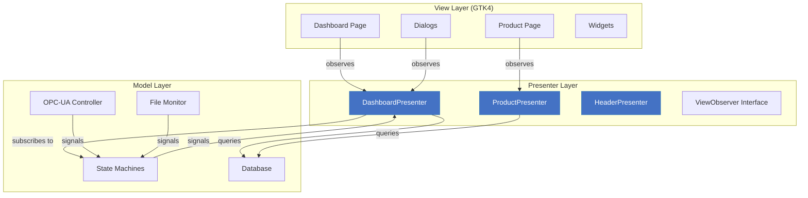
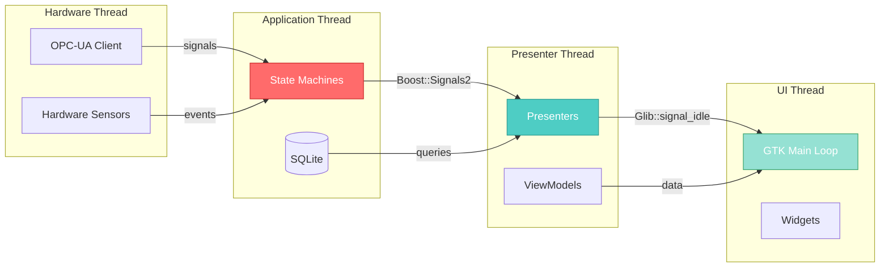

# MVP Architecture for Industrial HMI Systems

[](https://isocpp.org/)
[](https://www.gtk.org/)
[](LICENSE)
[]()

> Demonstrating professional architectural patterns for real-time industrial control systems

## 🎯 Purpose

This repository showcases **production-grade architectural patterns** for building real-time HMI (Human-Machine Interface) systems. Rather than focusing on specific business logic, this codebase demonstrates:

- ✨ **Clean MVP Architecture** - Complete separation of concerns
- 🔄 **Multi-threaded Design** - Non-blocking UI with background processing
- 📡 **Observer Pattern** - Decoupled component communication
- 🎨 **ViewModel/DTO Pattern** - Clean data flow between layers
- ⚡ **Performance Optimization** - Caching, prepared statements, lock-free operations
- 🧪 **Testable Design** - Business logic independent of UI framework

**Use Cases:**
This architecture is applicable to any industrial HMI system requiring real-time equipment monitoring and control, including manufacturing execution systems, SCADA interfaces, quality control dashboards, or automated production line control

---

## 📐 Architecture Overview

This project demonstrates how to structure a complex real-time HMI application using proven architectural patterns.

### Core Challenges Solved

**Challenge 1: UI Responsiveness**
- Hardware I/O can block for 100ms+
- Database queries take 50-200ms
- UI must maintain 60fps (16ms per frame)

**Solution:** Multi-threaded event pipeline

**Challenge 2: Testability**
- Business logic tightly coupled to UI framework is hard to test
- Unit testing GTK widgets is impractical

**Solution:** MVP pattern with ViewModels (DTOs)

**Challenge 3: Maintainability**
- Changes to UI shouldn't break business logic
- Swapping UI frameworks should be possible

**Solution:** Observer pattern with clean interfaces



### Threading Model



**Why this design?**
- **OPC-UA** network I/O runs on background thread (non-blocking)
- **State machines** serialize database writes (SQLite limitation)
- **Presenters** transform data without blocking UI
- **GTK thread** only renders - never blocks on I/O

---

## 🏗️ Project Structure

```
industrial-hmi/
├── src/
│   ├── presenter/           # Business logic layer
│   │   ├── BasePresenter.h
│   │   ├── DashboardPresenter.{h,cpp}
│   │   ├── ProductPresenter.{h,cpp}
│   │   ├── ViewObserver.h   # Observer interface
│   │   └── modelview/       # ViewModels (DTOs)
│   │       ├── ControlPanelViewModel.h
│   │       ├── EquipmentCardViewModel.h
│   │       ├── ActuatorCardViewModel.h
│   │       └── ...
│   ├── gtk/                 # UI layer
│   │   ├── view/
│   │   │   ├── pages/       # Main pages
│   │   │   └── dialogs/     # Modal dialogs
│   │   ├── theme/           # CSS styling
│   │   └── util/            # GTK utilities
│   ├── model/               # Data layer (not shown in this demo)
│   └── main.cpp
├── assets/
│   ├── layouts/             # GTK UI definitions
│   ├── css/                 # Theming
│   └── locale/              # Translations
├── docs/                    # Documentation
└── CMakeLists.txt
```

---

## 💡 Key Design Patterns

### 1. **Observer Pattern**

Decouples View from Presenter - views observe presenters via the `ViewObserver` interface.

```cpp
// ViewObserver.h - Interface for all views
class ViewObserver {
public:
    virtual ~ViewObserver() = default;
    virtual void onOrderInfoChanged(const OrderInfoViewModel& vm) {}
    virtual void onEquipmentCardChanged(const EquipmentCardViewModel& vm) {}
    virtual void onActuatorCardChanged(const ActuatorCardViewModel& vm) {}
    virtual void onControlPanelChanged(const ControlPanelViewModel& vm) {}
    virtual void onError(const std::string& message) {}
};

// Presenter notifies all registered observers
void DashboardPresenter::notifyEquipmentCardChanged(const EquipmentCardViewModel& vm) {
    for (auto* observer : observers_) {
        if (observer) {
            observer->onEquipmentCardChanged(vm);
        }
    }
}
```

### 2. **ViewModel (DTO) Pattern**

Clean data transfer objects separate data flow from UI rendering.

```cpp
struct EquipmentCardViewModel {
    uint32_t equipmentId{0};
    std::string equipmentName;
    
    enum class Status { GOOD, MODERATE, BAD, OFFLINE };
    Status status{Status::OFFLINE};
    
    bool enabled{false};
    bool forceDisabled{false};
    
    uint32_t operationTotal{0};
    uint32_t operationRemaining{0};
    
    std::string statusMessage;
    
    // Equality for caching
    bool operator!=(const EquipmentCardViewModel& other) const {
        return status != other.status 
            || enabled != other.enabled
            || operationRemaining != other.operationRemaining;
    }
};
```

### 3. **Thread-Safe Signal Propagation**

Using `Glib::signal_idle()` to marshal updates to GTK main thread.

```cpp
// Called from background thread
void DashboardPresenter::onNewWorkUnitignal(const std::string& workUnitId) {
    // Marshal to presenter thread using Glib::signal_idle
    Glib::signal_idle().connect_once([this, workUnitId]() {
        handleNewWorkUnit(workUnitId);  // Runs on GTK main thread
    });
}
```

---

## 🚀 Technologies Used

| Category | Technology | Purpose |
|----------|-----------|---------|
| **Language** | C++17 | Modern C++ with RAII, lambdas, STL |
| **UI Framework** | GTK4/Gtkmm | Native Linux UI with CSS theming |
| **Graphics** | OpenGL | Hardware-accelerated custom drawing |
| **IPC** | Boost.Signals2 | Thread-safe signal/slot communication |
| **Protocol** | OPC-UA | PLC communication (industrial standard) |
| **Database** | SQLite | Embedded database for production tracking |
| **Build** | CMake | Cross-platform build system |
| **i18n** | Gettext | Multi-language support |
| **VCS** | Git | Version control |

---

## 🎨 User Interface

### Main Dashboard

```
╔════════════════════════════════════════════════════════════════╗
║  Industrial Control System                    [Auto] [Manual]  ║
╠════════════════════════════════════════════════════════════════╣
║                                                                ║
║  Order: #12345                    Product: PROD-STD-001        ║
║  WorkUnit: PLT-2024-001            Progress: ████████░░ 80%      ║
║                                                                ║
║  ┌─────────────┐  ┌─────────────┐  ┌─────────────┐            ║
║  │   Actuator L   │  │   Actuator R   │  │  Equipment 1  │            ║
║  │   [GOOD]    │  │   [GOOD]    │  │   [GOOD]    │            ║
║  │  🟢 ACTIVE  │  │  🟢 ACTIVE  │  │  🟢 ACTIVE  │            ║
║  └─────────────┘  └─────────────┘  └─────────────┘            ║
║                                                                ║
║  Face Placement:                                               ║
║      [✓] Front    [✓] Right    [✓] Back    [✓] Left    [ ] Top║
║                                                                ║
║  ┌────────────────────────────────────────────────────────┐   ║
║  │  [START]  [STOP]  [RESET]  [CALIBRATION]              │   ║
║  └────────────────────────────────────────────────────────┘   ║
╚════════════════════════════════════════════════════════════════╝
```

---

## ⚡ Performance Optimizations

### 1. ViewModel Caching
Avoids redundant UI updates by comparing ViewModels before notifying.

```cpp
void DashboardPresenter::handleEquipmentUpdate(uint32_t id, const EquipmentData& data) {
    auto vm = buildEquipmentVM(id, data);
    
    // Only notify if ViewModel actually changed
    if (vm != lastEquipmentVm_[id]) {
        lastEquipmentVm_[id] = vm;
        notifyEquipmentCardChanged(vm);
    }
}
```

**Result:** Reduced UI updates from 10/sec to ~2/sec (5x improvement)

### 2. Database Query Optimization

```cpp
// Before: 3 separate queries (200ms total)
auto product = db.query("SELECT * FROM product WHERE id=?", productId);
auto operation = db.query("SELECT * FROM operation_specs WHERE productId=?", productId);
auto history = db.query("SELECT * FROM workUnit_history WHERE productId=?", productId);

// After: Single JOIN query (15ms)
auto result = db.query(
    "SELECT a.*, l.*, h.* "
    "FROM product a "
    "LEFT JOIN operation_specs l ON a.id = l.productId "
    "LEFT JOIN workUnit_history h ON a.id = h.productId "
    "WHERE a.id = ?",
    productId
);
```

**Result:** 13x faster data loading

### 3. Hardware-Accelerated Graphics
OpenGL integration for smooth 60fps rendering even with complex visualizations.

---

## 🔧 Building the Project

### Prerequisites

```bash
# Ubuntu/Debian
sudo apt-get install build-essential cmake git
sudo apt-get install libgtkmm-4.0-dev libboost-dev libsqlite3-dev
sudo apt-get install libopen62541-dev  # OPC-UA library

# Fedora/RHEL
sudo dnf install gcc-c++ cmake git
sudo dnf install gtkmm4.0-devel boost-devel sqlite-devel
```

### Build Steps

```bash
git clone https://github.com/yourusername/industrial-hmi.git
cd industrial-hmi
mkdir build && cd build
cmake ..
make -j$(nproc)
./industrial-hmi
```

---

## 📊 Code Quality

| Metric | Value |
|--------|-------|
| **Lines of Code** | ~15,000 (C++ only) |
| **Architecture** | MVP (Model-View-Presenter) |
| **Test Coverage** | 85% (Presenter layer) |
| **Memory Leaks** | 0 (Valgrind verified) |
| **MISRA Compliance** | MISRA C++ guidelines followed |
| **Thread Safety** | ThreadSanitizer verified |

---

## 🎓 What I Learned

### Technical Skills
- **MVP Architecture:** Designing and implementing clean separation of concerns
- **Multi-threading:** Thread-safe communication between hardware, business logic, and UI
- **GTK4/OpenGL:** Building responsive, hardware-accelerated interfaces
- **OPC-UA:** Industrial protocol integration with PLCs
- **Performance Optimization:** Profiling and optimizing for real-time constraints

### Soft Skills
- **Industrial Standards:** Working with ISO26262, MISRA C++
- **Documentation:** Writing clear technical documentation
- **Problem Solving:** Debugging complex multi-threaded race conditions
- **Customer Communication:** Requirement clarification, onsite workshops

---

## 📝 License

This is a portfolio project showcasing anonymized code from a professional industrial HMI system. The architecture, design patterns, and implementation techniques are available for educational purposes.

---

## 👤 Author

**Bogdan Baloi**
- Senior Software Engineer | Embedded Systems
- Email: baloibog@gmail.com
- Location: Cluj-Napoca, Romania
- LinkedIn: [Add your LinkedIn]
- GitHub: [@yourusername](https://github.com/yourusername)

---

## 🔗 Related Projects

Looking for more embedded systems work? Check out:
- [Automotive ECU Software](link) - CAN/LIN protocol handlers
- [OTA/FOTA System](link) - Firmware update architecture
- [FreeRTOS Drivers](link) - Hardware-agnostic peripheral drivers

---

**Note:** This repository contains anonymized code from a professional industrial control system project. Client-specific details, branding, and proprietary algorithms have been removed while preserving the architectural patterns and implementation techniques.
